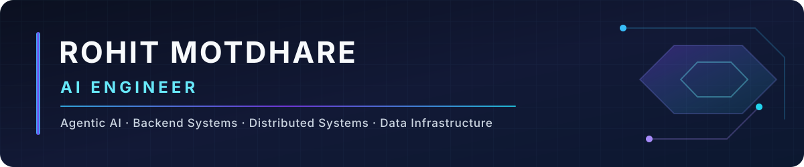

  

# 👋 Hi, I'm Rohit Motdhare

**AI Engineer · San Francisco, CA**

## 🚀 About Me

- 🤖 Building agentic AI, RAG, human-in-the-loop, and production-minded AI systems
- 💻 Experienced across backend engineering, distributed systems, and cloud/data infrastructure
- 📍 Based in San Francisco, CA
- 🎓 M.S. Data Analytics Engineering — George Mason University, May 2025
- 🧠 Interested in reliable AI systems where probabilistic models operate inside explicit engineering boundaries
- 🌐 Explore my work at [rohit16111999.github.io](https://rohit16111999.github.io)

## 🛠️ Tech Stack

### 💻 Programming Languages

   

### 🤖 Agentic AI & LLM Systems

       

### 🧠 Machine Learning & NLP

    

### ⚙️ Backend & Databases

    

### ☁️ Cloud & Infrastructure

    

### 🔄 Data Engineering & Platforms

       

### 🛠️ DevOps & Engineering

  

## 🚀 Featured Projects

### 🤖 [ExceptionOS](https://github.com/rohit16111999/ExceptionOS)

Agentic operations system that turns a human correction for a novel exception into reusable procedural knowledge, so analogous future cases can resolve autonomously. **Human correction → learned skill → future automation.**

`Next.js` · `TypeScript` · `LangGraph` · `Human-in-the-loop` · `MCP`  
**[Repository](https://github.com/rohit16111999/ExceptionOS) · [Live Demo](https://exceptionos.onrender.com) · [Video](https://www.youtube.com/watch?v=jZ4-JMuJGbU)**

---

### 🔎 [LocalJobAgent](https://github.com/rohit16111999/LocalJobAgent)

Privacy-first local AI agent for job discovery, deterministic eligibility filtering, local LLM ranking, truthful application preparation, provenance verification, and human-reviewed browser assistance. **The LLM does not decide what must be true.**

`Python` · `Ollama` · `Qwen3` · `Playwright` · `Pydantic` · `SQLAlchemy`  
**[Repository](https://github.com/rohit16111999/LocalJobAgent)** · 107 automated tests passed

---

### 🛡️ [ProofPay](https://github.com/rohit16111999/ProofPay)

Evidence firewall for autonomous AI payments: an AI proposes an action while a deterministic Guardian validates evidence before simulated execution. **Payments are simulated.**

`Jac` · `Agentic AI` · `Graph State` · `Deterministic Validation`  
**[Repository](https://github.com/rohit16111999/ProofPay)** · 92 / 92 test executions passing

---

### 🔐 [EntitleGuard](https://github.com/rohit16111999/entitleguard)

Identity-aware SaaS application that detects entitlement drift between Auth0 identity, Stripe subscription state, and authorization rules.

`Next.js` · `TypeScript` · `Auth0` · `Stripe` · `PostgreSQL` · `Webhooks`  
**[Repository](https://github.com/rohit16111999/entitleguard) · [Live Demo](https://entitleguard-access-integrity-lab.motdharer1999.chatgpt.site/)**

---

### ☁️ [Spotify Data Engineering on AWS](https://github.com/rohit16111999/spotify-data-engineering-aws)

End-to-end AWS data pipeline that transforms preprocessed Spotify datasets with Glue and PySpark, stores Parquet in S3, queries through Athena, and visualizes through QuickSight.

`AWS` · `S3` · `Glue` · `PySpark` · `Athena` · `QuickSight`  
**[Repository](https://github.com/rohit16111999/spotify-data-engineering-aws)**

---

### 🌍 [GaiaViz — UN SDG 3D Explorer](https://github.com/rohit16111999/sdg-3d-visualization-gaiaviz)

Team capstone transforming UN Sustainable Development Goal data into interactive 3D visualizations across SDGs 6, 16, and 17 — covering **195 countries, 130K+ nodes, and 90K+ links**.

`Python` · `ArcGIS` · `GaiaViz` · `Geospatial Data`  
**[Repository](https://github.com/rohit16111999/sdg-3d-visualization-gaiaviz)**

## 🧠 How I Think About AI Systems

> **AI where judgment is needed.**  
> **Deterministic software where correctness is required.**  
> **Humans where decisions carry consequences.**

- Model outputs are untrusted until validated.
- Facts should carry provenance.
- Failure recovery belongs in the architecture.

## 🤝 Connect With Me

